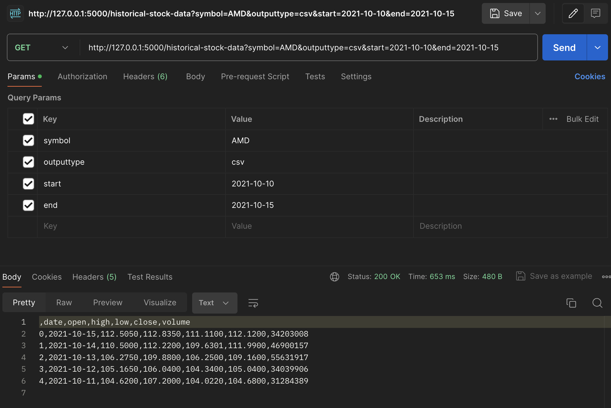

# Quantitative Graph Theory API

## Getting Started

This tool was created with the intent to help individuals vizualize fluctations in the stock market, the performance of stock holdings overtime, and understand the underlying graph theory driving these changes. With this set of tools, users will be able to view the correlation between stocks and sectors to increase awareness of diversification and experiment with different portfolio allocations. There are additional tools to support future projects in the field of quantitative graph theory by exporting data generated on the site to CSV files and others.

The proof of concept for this project is an easy to use and accessible API that allows clients to generate datasets for analysis. In the future, I would like to implement a frontend interface that allows users to interact with the data in a more meaningful way. This will include the ability to create custom graphs, compare different datasets, and export the data to a CSV file.

### Features

- Historical Stock Data Exportation Tool

## Software Design and Architecure

I knew that I wanted to use Python in some way for this project because of the vast amount of libraries available for data manipulation and graph theory. To that end, I decided to use Flask because of its simplicity. In the future, I would like to implement an API with proper documentation to make the process of integrating datasets into future projects easier. Some of the libraries I am using are:

- [Pandas](https://pandas.pydata.org/): manipulate the data
- [Numpy](https://numpy.org/): to perform calculations
- [NetworkX](https://networkx.org/): create the graphs
- [Matplotlib](https://matplotlib.org/): display the graphs

I also knew that I wanted to use a web framework to create a user interface for the project. I went with VueJS since I had some slight experience in the past. Angular is usually my go-to but I figured it would be too heavy and require more time to set-up. For additional asthetics, I am using TailwindCSS to style the site quickly. With just a few modifications to the `tailwind.config.js` file, I was able to give the site a unique color pallete and implement other uniform style classes throughout the site.

With that, I have a basic understanding of the tools I will be using and how they will interact with each other. I will now begin to set-up the project.

### Repository Configuration

I elected to go with a Mono-Repository design for this project. Having both the frontend and backend directory in the same repository will make it easier to manage the project as a whole. At some point, I would like a repository for both the frontend and backend especially if I begin getting support from contributors. For the time being, I will be using the following directory structure:

```
quantitative-graph-theory-visualizer
├── frontend
│   ├── <my vue project>
│
├── backend
│   ├── <my flask project>
│
├── final_paper
│   ├── Latex file for official paper
│   ├── A simple python script for paper specific computations
│
├── README.md
```

You can view the most up to date version of the project on the [GitHub Repository](https://github.com/BlakeMarterella/quantitative-graph-theory-visualizer)

### Frontend Initial Set-Up

To create a new VueJS project with TailwindCSS, use the Vite to set up a new project. Instructions for how to do this can be found on [Tailwind CSS's official documentation](https://v2.tailwindcss.com/docs/guides/vue-3-vite). A summary of these instructions can be found below:

#### Create a new VueJS/Vite project

```shell
# Create a new vite project
npm init vite frontend

# You are now in the directory of your new project!
cd frontend

# Install Vite's front-end dependencies
npm install
```

#### Install TailwindCSS

Next, you will need to install TailwindCSS and its dependencies. You can do this by running the following commands:

```shell
# Install Tailwind and its dependencies
npm install -D tailwindcss@latest postcss@latest autoprefixer@latest

# Create configuration files
npx tailwindcss init -p
```

If you follow the [Tailwind CSS's official documentation](https://v2.tailwindcss.com/docs/guides/vue-3-vite), you will learn more about further optimizations with TailwindCSS. For now, I will be using the default configuration. At this point you are now ready to start the development server for the first time:

```shell
# Start the development server
npm run dev
```

### Backend Initial Set-Up

#### Create a new Flask project

To create the Flask backend requires a little more manual labor than creating a new frontend project but it's simple with the steps below:

```shell
# Create a new directory for the backend
mkdir backend
cd backend

# Create a new virtual environment
python3 -m venv venv

# Activate the new virtual environment (you will need to do this anytime you close your terminal)
source venv/bin/activate

# Install Flask
pip install Flask
```

Now you will need to create the entry point to your flask app:

```shell
# Create a new file called app.py
touch app.py
```

My project all started with this sample code:

```python
from flask import Flask, jsonify
app = Flask(__name__)

@app.route('/')
def hello_world():
    return 'Hello, World!'

if __name__ == '__main__':
    app.run(debug=True)
```

#### Historical Stock API

Before we began processing any stock data, we need some way to collect it. There are many historical stock API's that I can choose from but a lot of them are either too expensive or have limitations on the number of requests that can be made. Some of the APIs, such as [Alpaca API](https://alpaca.markets/), which I have experience with in the past, supports real-time data and trading which is a little more than is needed at this time. I elected to go with the [Alpha Advantage](https://www.alphavantage.co/) API because of it's realtime and historical stock market data, the ability to support analysis of different commodoties such as cryptocurrency, forex, etc. (this may be important for future development), and the fact that it is free to use (up to 25 requests per day).

The process for using Alpha Advantage is as simple as going to their website, entering your email, and recieving an API key. Note that for the free tier, you are able to make up to 25 requests per day. This number was not enough so for the purpose of this project, I purchased the premium version of the API. This will allow me to make up to 75 requests per minute which should be more than enough for the purposes of this project. To uphold security, the API key will be stored in a `.env` file and not pushed to the repository. I will use python's `dotenv` library to access the key in my code. See `example.env` for formatting of the `.env` file. The code below shows how to access the API key in the Flask app:

```python
from dotenv import load_dotenv, find_dotenv

# Load environment variable from the .env file (if it exists)
_env_file = find_dotenv()
if _env_file:
    load_dotenv(_env_file)
    
API_KEY = os.getenv('API_KEY')
```

## Implementing First API Endpoint

The first feature that I am going to implement is the Stock Market Data Exportation Tool. This tool will allow users to input a stock symbol and a date range and receive a CSV or JSON file with the stock data for the date range. This will be useful for users who want to analyze the data in a spreadsheet or use it in another program. Additionally, I chose it as my first feature becasuse I will use it to perform calculations for my paper with the various data sets that my site generate. The list below outlines the requirements for this feature, this is also out *definition of done*.

Requirements:

- Client should be able to input a stock symbol
- Client should be able to input a date range
- The tool should export data as a CSV or JSON file
- The tool should be able to handle errors gracefully (bad symbol, invalid date range, etc.)
- The tool should clean and format the data properly (including proper datatypes for the various columns)
- The tool should be well-documentated and easy to use

A lot of the endpoints in this project revolve around data cleaning, processing, and returning. I summarized the steps to implement the first endpoint, and a general outline for the rest of the endpoints, below:

1. Create a new route in Flask
2. Query the Alpha Advantage API
3. Process Data
4. Return Data

For the purpose of the demonstration, I will describe how I performed each one of these steps below for my new endpoint `historical-stock-data`.

### __Step 1__: Create new route in Flask

This step may be the easiest step, all that is needed is the decorator to specify the route and a new function:

```python
@app.route('/historical_data/<ticker>')
def get_ticker(ticker):
    return "HELLO WORLD!"
```

### __Step 2__: Query the Alpha Advantage API

I will be using the `requests` library so that my Flask API can make requests to the Alpha Advantage. The Alpha endpoint I am using is [`TIME_SERIES_DAILY`](https://www.alphavantage.co/documentation/#daily) because it has 20+ years of historical data for any given stock ticker. If you look at the official documentation you can see the various parameters that can be passed to the endpoint.

```python
    # Retrieve parameters from the query string
    symbol = request.args.get('symbol', default='IBM', type=str)  # Default to 'IBM' if not provided
    outputsize = request.args.get('outputsize', default='full', type=str)  # Default to 'compact'
    datatype = request.args.get('datatype', default='json', type=str)  # Default to 'json', 'csv' is also supported

    # Construct the API URL
    url = f"https://www.alphavantage.co/query?function=TIME_SERIES_DAILY&symbol={symbol}&outputsize={outputsize}&datatype={datatype}&apikey={API_KEY}"

    # Make the GET request
    response = requests.get(url)
```

### __Step 3__ and __Step 4__: Process and Return Data

Now that the response has been recieved from the API, it's time to process the data. Since the API does not allow me to specify a date range, I will have to filter the data on my end using pandas.

```python
# First check if the request was successful
response.status_code == 200:
    if response.status_code == 200:
        data = response.json()
        df = pd.DataFrame(data['Time Series (Daily)']).T
        df.index = pd.to_datetime(df.index)
        
        # Rename the columns
        df['date'] = df.index
        df = df.rename(columns={'1. open': 'open', '2. high': 'high', '3. low': 'low', '4. close': 'close', '5. volume': 'volume'})
        
        
        # Reorder the columns with the date first
        df = df[['date', 'open', 'high', 'low', 'close', 'volume']]
        
        # Filter data based on date range
        if start_date and end_date:
            df = df.loc[(df['date'] >= start_date) & (df['date'] <= end_date)]
        
        # Remove the index column
        df = df.dropna().reset_index().drop(columns = 'index')
            
        if outputtype == 'json':
            result = df.to_json()
            return result
        elif outputtype == 'csv':
            # Convert DataFrame back to CSV
            return df.to_csv(), 200, {'Content-Type': 'text/csv'}
```

### Testing the endpoint

To test the endpoint, I am using Postman. Postman is a great tool for testing APIs because it allows you to make requests to your API and see the response. It also allows you to set up tests to ensure that your API is working correctly. I will be using Postman to test the `historical-stock-data` endpoint that I just created.

In the screenshot below, you can see that I request historical data for `AMD` stock for January 2024. The response is a JSON object with the stock data for that date range.



## Future Development

### Implementing Swagger

Everything up to this point has been simple, straightforward, and perfect for building a quick API for a personal project. However, as the project grows, it will be important to have proper documentation for the API. This is where Swagger comes in. Swagger is a tool that allows you to create interactive documentation for your API. It is a great way to keep track of all the endpoints, parameters, and responses that your API supports. It also allows you to test your API directly from the documentation page (something that I could've used when I was building the first feature).

The switch to Swagger involves refactoring the structure of the backend directory:

```
backend
├── runserver.py # Entry point for the Flask app
├── app
│   ├── __init__.py
│   ├── 


│   ├── api
│   │   ├── __init__.py
│   │   ├── historical_stock_data.py
│   │   ├── swagger.py
```
